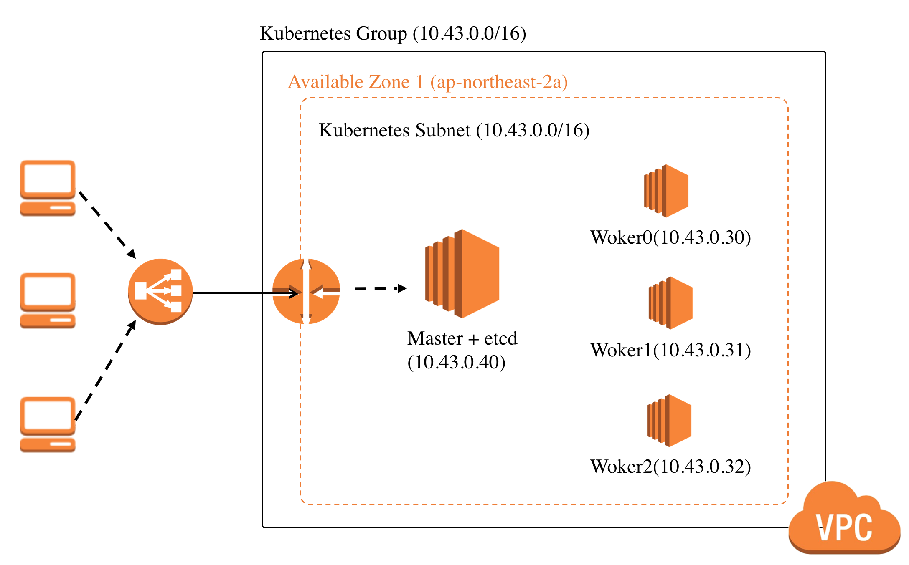

[](https://datalayer.io)

# AWS Kubeadm Terraform

> Taken from https://github.com/graykode/aws-kubeadm-terraform

```bash
ssh-keygen -t rsa -N "" -f key
```

Replace with effective values.

+ AWS_ACCOUNT_ID=Your_AWS_Account_ID
+ HOSTNAME=Your_Hostname
+ CERTIFICATE_ID=Your_AWS_Certificate_ID

```python
# Replace in variables.tf the k8stoken variable with any new value created with the following code.
python -c 'import random; print("%0x.%0x" % (random.SystemRandom().getrandbits(3*8), random.SystemRandom().getrandbits(8*8)))'
# e.g.
# 7bfe4.315927fa8ee97aec
```

```bash
tf11 init
tf11 plan
tf11 apply -auto-approve
```

Add following inline policy to `kubeadm_role` with effective value.

```json
    {
      "Sid": "",
      "Effect": "Allow",
      "Principal": {
        "AWS": "arn:aws:iam::AWS_ACCOUNT_ID:role/kubeadm_role"
      },
      "Action": "sts:AssumeRole"
    }
```



## SSH

```bash
MASTER_IP=$(tf11 output kubernetes_controlplane_public_ip)
ssh -i key ubuntu@$MASTER_IP
```

```bash
scp -i key ubuntu@$MASTER_IP:~/.kube/config ~/.datalayer/k8s/config
# In ~/.datalayer/k8s/config, update the api server with the DNS name.
kubectl get nodes
kubectl get pods --all-namespaces
```

```bash
WORKER_IP=$(tf11 output kubernetes_workers_public_ip)
ssh -i key ubuntu@$WORKER_IP
```

## Deploy Applications

Read the [Docs][./docs/README.md].

## Destroy

```bash
tf11 destroy -auto-approve
```
<!--
```bash
docker run -it graykode/aws-kubeadm-terraform:0.3 /bin/bash
```

#### If you want to see Kubernetes Clustering Step.

```bash
$ tail -f /home/ubuntu/controlplane.log # in master node
$ tail -f /home/ubuntu/worker.log # in worker node
$ tail -f /home/ubuntu/etcd.log # in etcd node
```

### 3. Set [variables.tf](https://github.com/graykode/aws-kubeadm-terraform/blob/master/variables.tf)


Set EC2 instance_type

```javascript
variable etcd_instance_type {
  default = "t2.medium"
}
variable controller_instance_type {
  default = "t2.medium"
}
variable worker_instance_type {
  default = "t2.medium"
}
```

Set Number of EC2 Node 

```javascript
variable number_of_etcd{
  description = "The number of etcd, only acts as etcd"
  default = 0
}

variable number_of_worker{
  description = "The number of worker nodes"
  default = 1
}
```

If you meet `provider.aws: error validating provider credentials` Error, Please check that your IAM key is activate.

TODO

- Set up a High Availability etcd cluster with kubeadm
- Add k8s master node ingress, ingress-controller with ELB

- Reference : [alicek106/aws-terraform-kubernetes](https://github.com/alicek106/aws-terraform-kubernetes), [cablespaghetti/kubeadm-aws](https://github.com/cablespaghetti/kubeadm-aws)
- Tae Hwan Jung(Jeff Jung) @graykode
- Author Email : [nlkey2022@gmail.com](mailto:nlkey2022@gmail.com)
-->

# Other Kubeadm Terraform

+ https://github.com/scholzj/terraform-aws-kubernetes
+ https://github.com/inercia/terraform-provider-kubeadm
+ https://github.com/jpweber/kubeadm-terraform
+ https://github.com/upmc-enterprises/kubeadm-aws
+ https://ifritltd.com/2019/06/16/automating-highly-available-kubernetes-cluster-and-external-etcd-setup-with-terraform-and-kubeadm-on-aws
