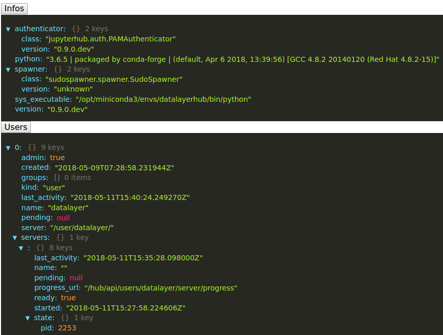
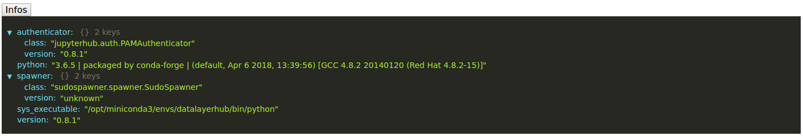
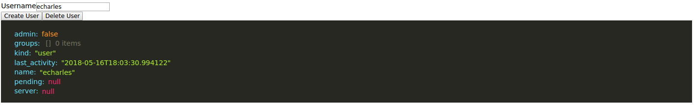
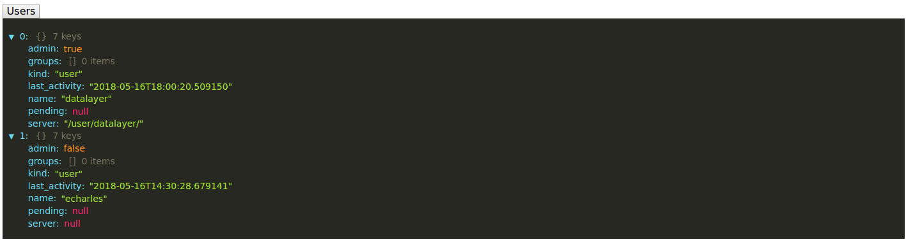

[](https://datalayer.io)

# Minihub Experiments JupyterHub API Browser

This folder provides a service to be deployed in your [JupyterHub](https://github.com/jupyterhub/jupyterhub) to query the exposed API endpoints.



```bash
# Activate the minihub conda environment.
conda activate minihub
# Install the javascript libraries and build the frontend.
# For frontend iterative development, use `yarn watch` instead of `yarn build`.
yarn && \
  yarn build
```

```bash
# Start jupyterhub with the provided ./jupyterhub_config.py configuration.
jupyterhub \
  --config ./jupyterhub_config.py \
  --ip 127.0.0.1 \
  --pid-file /tmp/jupyterhub.pid \
  --port 8907 \
  --debug
# Authenticate as an admin user, which will be the user you are running the server - Run whoami to get that user.
open http://127.0.0.1:8907
# If you run the service with HubOAuthenticated, Authorize the OAuth access.
open http://127.0.0.1:8907/services/api-browser/info
# Open the service URL in your favorite browser - Don't forget the trailing slash...
open http://127.0.0.1:8907/services/api-browser/
```

## Info



## Users



## User Management


