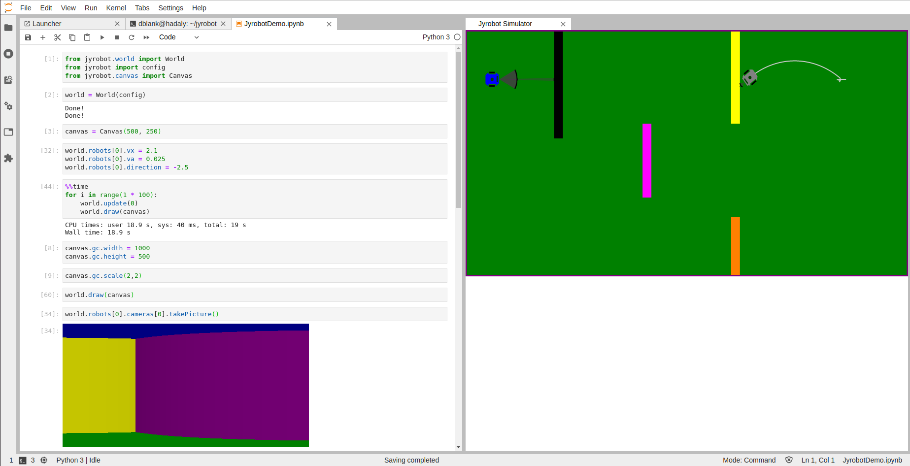

# JupyterLab IPyWidgets

- [IPyWidgets Docs](https://jupyter.org/widgets)
- [IPyWidgets GitHub](https://github.com/jupyter-widgets/ipywidgets)

- [Comms](/lab/comms.md)
- [Output Spec](/lab/output-spec.md)

## Docs

- [IPyWidgets RDT](https://ipywidgets.readthedocs.io/en/latest).
- [Low Level Widget Tutorial](https://ipywidgets.readthedocs.io/en/latest/examples/Widget%20Low%20Level.html)
- [IPyWidgets Examples](https://github.com/jupyter-widgets/ipywidgets/tree/master/docs/source/examples).

- [Authoring Custom Jupyter Widgets](https://blog.jupyter.org/authoring-custom-jupyter-widgets-2884a462e724).
- [Interactive Controls for Jupyter Notebooks](https://towardsdatascience.com/interactive-controls-for-jupyter-notebooks-f5c94829aee6).

## JupyterLab IPyWidgets Manager

- [IPyWidgets JupyterLab Manager](https://github.com/jupyter-widgets/ipywidgets/tree/master/packages/jupyterlab-manager).

## Implementations

- [bqplot](https://github.com/bloomberg/bqplot)
- [d3-slider](https://gitlab.com/oscar6echo/jupyter-widget-d3-slider)
- [drawing-pad](https://github.com/ocoudray/jupyter-drawing-pad)
- [ipycytoscape](https://github.com/quantstack/ipycytoscape)
- [ipydatagrid](https://github.com/bloomberg/ipydatagrid)  
- [ipyleaflet](https://github.com/jupyter-widgets/ipyleaflet)
- [ipymaterialui](https://github.com/maartenbreddels/ipymaterialui)
- [ipypivot](https://github.com/pierremarion23/ipypivot)
- [ipytree](https://github.com/auantstack/ipytree)
- [ipyplotly](https://github.com/jonmmease/ipyplotly)
- [ipyresuse](https://github.com/jtpio/ipyresuse)
- [ipyscales](https://github.com/vidartf/ipyscales)
- [ipysheet](https://github.com/quantstack/ipysheet)
- [ipyvolume](https://github.com/maartenbreddels/ipyvolume)
- [ipyvuedraggable](https://github.com/mariobuikhuizen/ipyvuedraggable)
- [ipywebrtc](https://github.com/maartenbreddels/ipywebrtc)
- [nglview](https://github.com/arose/nglview)
- [pythreejs](https://github.com/jupyter-widgets/pythreejs)
- [sidecar](https://github.com/jupyter-widgets/jupyterlab-sidecar)
- [qgrid](https://github.com/quantopian/qgrid)
- [ipydata](https://github.com/vidartf/ipydatawidgets)

- https://github.com/ipyannotate/ipyannotate
- https://github.com/yomguithereal/ipysigma
- https://github.com/martinrenou/ipycanvas
- https://github.com/nmearl/ipysplitpanes
- https://github.com/nmearl/ipygoldenlayout
- https://github.com/mariobuikhuizen/ipyvue
- https://github.com/mariobuikhuizen/ipyvuetify
- https://github.com/jupyter/pythreejs
- https://github.com/timkpaine/ipydagred3

## Javascript Output

- [Jupyter Lab extension to support JavaScript output which are disabled in JupyterLab](https://github.com/jupyterlab/jupyterlab/issues/3748)

```js
%%javascript
alert('Hello!')
```

## Install

```bash
# When using virtualenv and working in an activated virtual environment, the --sys-prefix option may be required to enable the extension and keep the environment isolated (i.e. jupyter nbextension enable --py widgetsnbextension --sys-prefix).
pip install ipywidgets
jupyter nbextension enable --py widgetsnbextension
# With conda.
conda install -c conda-forge ipywidgets
```

```bash
# To install the JupyterLab extension you also need to run the command below in a terminal which 
# requires that you have nodejs installed. For example, if using conda environments, you can install nodejs with.
conda install -c conda-forge nodejs
# Then you can install the labextension:
jupyter labextension install @jupyter-widgets/jupyterlab-manager
```

## Tutorials

- [Getting Started with JupyterLab | SciPy 2019 Tutoria](https://www.youtube.com/watch?v=RFabWieskak)
- https://www.youtube.com/watch?v=RFabWieskak&t=8957s
- https://github.com/jupyterlab/scipy2019-jupyterlab-tutorial

- [Getting Started with JupyterLab (Beginner Level) | SciPy 2018 Tutorial](https://www.youtube.com/watch?v=Gzun8PpyBCo)
- https://github.com/jupyterlab/scipy2018-jupyterlab-tutorial

- [IPyWidgets Tutorial](https://github.com/jupyter-widgets/tutorial).

- [2020-widgets-tutorial](https://github.com/jupytercon/2020-widgets-tutorial)
- [tutorial-2020](https://github.com/jupytercon/tutorial2020)

## Examples


```javascript
%%javascript
define('counter', ["jupyter-widgets/base"], function(widgets)) {
}
```

```python
import ipywidgets as widgets
from IPython.display import display, HTML

h = display(HTML('<progress min=0 max=100 value=10></progress>'), display_id='my-progress')
display(h)

t = widgets.Text(value='Hello World!', disabled=True)
display(t)

s = widgets.IntSlider()
display(s)

h.update(HTML('<progress min=0 max=100 value=30></progress>'))
s.value
s.value = 100

w.keys[
 '_dom_classes',
 '_model_module',
 '_model_module_version',
 '_model_name',
 '_view_count',
 '_view_module',
 '_view_module_version',
 '_view_name',
 'continuous_update',
 'description',
 'description_tooltip',
 'disabled',
 'layout',
 'max',
 'min',
 'orientation',
 'readout',
 'readout_format',
 'step',
 'style',
 'value'
]

a = widgets.FloatText()
b = widgets.FloatSlider()
display(a,b)
mylink = widgets.jslink((a, 'value'), (b, 'value'))
# mylink.unlink()
```

## Cookiecutter

- [IPyWidgets Cookie Cutter](https://github.com/jupyter-widgets/widget-cookiecutter)
- [IPyWidgets Typescript Cookie Cutter](https://github.com/jupyter-widgets/widget-ts-cookiecutter)

- [Plugin Shim](https://github.com/jupyter-widgets/widget-ts-cookiecutter/blob/master/%7B%7Bcookiecutter.github_project_name%7D%7D/src/plugin.ts#L40) that registers the widget in JupyterLab

- [Package JSON](https://github.com/jupyter-widgets/widget-ts-cookiecutter/blob/acb06b2b298608974d1b2ba66171ab83ec384c35/%7B%7Bcookiecutter.github_project_name%7D%7D/package.json#L72-L74) tells JupyterLab where to look for the JupyterLab shim

- [Webpack](https://github.com/jupyter-widgets/widget-ts-cookiecutter/blob/acb06b2b298608974d1b2ba66171ab83ec384c35/%7B%7Bcookiecutter.github_project_name%7D%7D/webpack.config.js#L11-L28) that packages up an extension

## React.js

- [IPy Material UI](https://github.com/maartenbreddels/ipymaterialui)

## Vue.js

- [IPy Vuetify](https://github.com/mariobuikhuizen/ipyvuetify).
- [IPy Vuetify Example](https://files.gitter.im/jupyter-widgets/Lobby/bzWa/ipyvuetifyExample.gif).
- [IPy Vuetify Examples](https://github.com/mariobuikhuizen/ipyvuetify/blob/master/examples/Examples.ipynb).
- [Vuetify](https://github.com/vuetifyjs/vuetify).

## Svelte

- [Creating Reactive Jupyter Widgets With Svelte](https://cabreraalex.medium.com/creating-reactive-jupyter-widgets-with-svelte-ef2fb580c05)
- [widget-svelte-cookiecutter](https://github.com/cabreraalex/widget-svelte-cookiecutter)

## Nteract

- https://github.com/nteract/nteract/issues/1385
- https://github.com/nteract/nes/tree/master/portable-widgets
- https://github.com/nteract/nteract/issues/4573

## Calysto

- https://github.com/calysto/jyrobot-widget



are you making 3D projections with ipycanvas? (looking at your camera.takePicture() method)
Thanks! Yes, it creates a very limited type of 3D projection. It was designed to create fast camera images without having to do too much work. Designed to be used in a class of students all running on a JupyterHub install, or on an Arduino.
super nice project!
Also hoping that this will be a foundation for a book on Deep Learning and Robots.
martinRenou
amazing! If this becomes a thing I would love to buy it, please keep me updated if you can

## Google Colab

- https://github.com/blois/jupyterlab-comms
- https://github.com/googlecolab/colabtools/blob/master/packages/outputframe/lib/index.d.ts
- https://github.com/googlecolab/colabtools
- https://github.com/googlecolab/colabtools/blob/095f304ca7d20961cd526858d153691d89714f6b/packages/outputframe/lib/index.d.ts#L2-L16
- https://colab.research.google.com/notebooks/snippets/advanced_outputs.ipynb#scrollTo=MprPsZJa3AQF
- https://colab.research.google.com/gist/blois/9ca9c4556b14f0cdb84d7fe1e5aee691/data-explorer.ipynb
- https://colab.research.google.com/notebooks/snippets/advanced_outputs.ipynb#scrollTo=9OyC1_bSEccg&line=7&uniqifier=1

## Proxy Widget

- https://github.com/aaronwatters/jp_proxy_widget
- https://github.com/aaronwatters/jp_doodle
- https://github.com/aaronwatters/widget-cookiecutter

## Drag and Drop

- [Add drag and drop based on @btel's work](https://github.com/jupyter-widgets/ipywidgets/pull/2720)
- https://wolfv.github.io/posts/2020/01/19/ipywidgets-writeup.html

## Msc

- https://github.com/kolibril13/jupyter-splitview

## Articles

- https://towardsdatascience.com/a-very-simple-demo-of-interactive-controls-on-jupyter-notebook-4429cf46aabd

## [DEPRECATED] Classic Notebook

- [Building a Custom Widget](https://ipywidgets.readthedocs.io/en/latest/examples/Widget%20Custom.html)
- [Javascript Error: define is not defined](https://github.com/jupyter-widgets/ipywidgets/issues/2379)
- [Jupyter Widget Hello World](https://github.com/pierremarion23/jupyter-widget-hello-world-binder)
- [First Widget](https://github.com/ocoudray/first-widget)
